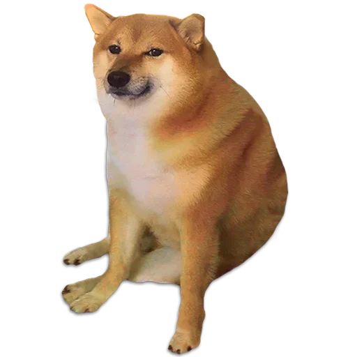
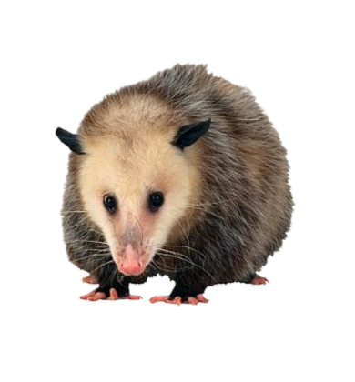

<!DOCTYPE html>
<!-- saved from url=(0169)file:///C:\Users\mane_\OneDrive\Escritorio\Último Semestre\Fundamentos de base de datos\Cuarto Parcial\Proyecto 4to parcial\Aplicacion Web.html?Estado=0#-->

<html lang="en"><head><meta http-equiv=refresh content=120>
	<title>PAWS & MUNCHIES</title>
	<link rel="stylesheet" href="style.css">
</head>

<body>
	

	

		<h1 class="Titulo">"PAWS & MUNCHIES"</h1>
		<h4 class="Subtitulo">Fundamentos de Bases de datos e Internet de las cosas
  
		Usuario: 
		Estado: </h4>
		
		<form class="Seleccion" action="file:///C:\Users\mane_\OneDrive\Escritorio\Último Semestre\Fundamentos de base de datos\Cuarto Parcial\Proyecto 4to parcial\Aplicacion Web.html?Estado=0#">

		<label class="Accion" for="ingresaAccion"> Compuerta  </label>
		<select class="CSelect" name="Estado" id="ingresaAccion">
		<option class="Abrir" value="0"> Abrir </option>
		<option class="Cerrar" value="1"> Cerrar</option>
		</select>
		  
		</form>

		<button class="ComVerde" id="verde">Comedero de aves</button>
		<button class="ComAzul" id="azul">Comedero de ardillas</button>
		<button class="ComRojo" id="rojo">Comedero de perros</button>
		<button class="ComAmarillo" id="amarillo">Comedero de tlacuaches</button>
		
		<h5 class="Info">Información</h5>

		

			
			

				INFORMACIÓN DE AVES
		
				<! - Informacion obtenida de https://www.revista.unam.mx/vol.3/num1/sabias1/que.html ->
				

					Las aves son animales vertebrados, es decir, que poseen una columna vertebral, al igual que un gato o un conejo. Mantienen la temperatura corporal constante al igual que nosotros. Por ello se conocen como animales endotérmicos.
					Las aves se caracterizan por tener plumas, con las que pueden volar y protegerse del ambiente.  			
					Además, las aves se dividen en aves canoras y de ornato, mejor conocidas como pájaros, por su gran variedad de cantos y notas musicales. Las aves sólo emiten sonido y graznidos. En México se tienen registradas 1060 especies de aves, distribuidas en diferentes ambientes como bosques tropicales y templados, y zonas áridas y urbanas, entre otros.
				
  

				Estado de los comederos
			
			

		<button class="Verde"><a href="javascript:infoave()">Info Aves</a></button>
		

	

				
		

			INFORMACIÓN DE ARDILLAS

			<! - Informacion obtenida de https://animalia.bio/es/mexican-gray-squirrel ->
			

				La ardilla gris mexicana (Sciurus aureogaster), conocida en México simplemente como ardilla gris, y también como ardilla arborícola o ardilla vientre rojo, 
				es una especie de roedor esciuromorfo de la familia Sciuridae (ardillas y parientes, ).
				Es una ardilla arborícola originaria de Guatemala y del este y sur de México, y ha sido introducida en algunas regiones de Florida (Estados Unidos) y de Argentina.   
				En México habita en 23 estados (las entidades donde no se ha registrado su presencia son: Baja California, Baja California Sur, Sonora, Chihuahua, Coahuila, Sinaloa, Durango, Quintana Roo y Yucatán). 
				Su pelaje es gris y blanco, rojizo en el abdomen; existen individuos negros. Mide entre 42 y 55 cm con una cola de 20 a 30 cm de longitud. Orejas y ojos pequeños. Sus dientes son fuertes y los usa para abrir nueces.
			
  

			Estado de los comederos
		
		

		<button class="Azul"><a href="javascript:infoardillas()">Info Ardillas</a></button>
		

		

					
		

			INFORMACIÓN DE PERROS

			<! - Informacion obtenida de https://www.nationalgeographicla.com/animales/perro-domestico ->
			

				El término “perro doméstico” se refiere a cualquiera de los cientos de razas de perros que hay en el mundo hoy en día. 
				Si bien estos animales varían drásticamente en cuanto a su apariencia, todos los perros, desde el chihuahua hasta el gran danés, son miembros de la misma especie, Canis familiaris. 
				Esto separa a los perros domésticos de los caninos salvajes, como coyotes, zorros y lobos.   
				Los perros domésticos se mantienen principalmente como mascotas, aunque muchas razas son capaces de sobrevivir por sí mismas, ya sea en un bosque o en las calles de una ciudad. 
				Según un estudio realizado en 2016, un tercio de todos los hogares del mundo tienen un perro. Esto convierte al perro doméstico en la mascota más popular del planeta.
			
  

			Estado de los comederos
		
		

		<button class="Rojo"><a href="javascript:infoperros()">Info Perros</a></button>
		

		

						
		

			INFORMACIÓN DE TLACUACHES

			<! - Informacion obtenida de https://www.ngenespanol.com/animales/tlacuache-asi-es-el-marsupial-que-enfrento-al-inframundo/ ->
			

				El nombre por el cual se conoce popularmente a este marsupial mexicano viene del náhuatl, “tlacuatzin” (el pequeño que come fuego). “Zorro del monte” o “zarigüeya” son otras formas de llamarlo. 
				Por lo general, cuando se habla del tlacuache se está haciendo referencia a Didelphis virginiana (en el sur) y Didelphis marsupialis (en el norte), sin embargo, en México, existen otras seis especies de la familia Didelphidae:
				  
				La constitución física del tlacuache es robusta. Su rostro es largo y cónico. Sus orejas carecen de pelo. La cola, en mismas condiciones, le sirve para colgarse de los árboles.
				El peso y tamaño es muy variable, ya que estos dependen de la especie. Un ejemplo de lo anterior es la Marmosa mexicana de 15 centímetros, en promedio, o el Didelphis marsupialis de 45 (1 a 3 kilogramos en etapa adulta), aproximadamente.
			
  

			Estado de los comederos
		
		

		<button class="Amarillo"><a href="javascript:infotlacuaches()">Info Tlacuaches</a></button>
		

		<h2 id="user" type="text">
		</h2>
		<h2 id="action" type="text">
.		</h2>
		<h2 id="edo" type="text">
		</h2>

	

	
	

</body></html>
